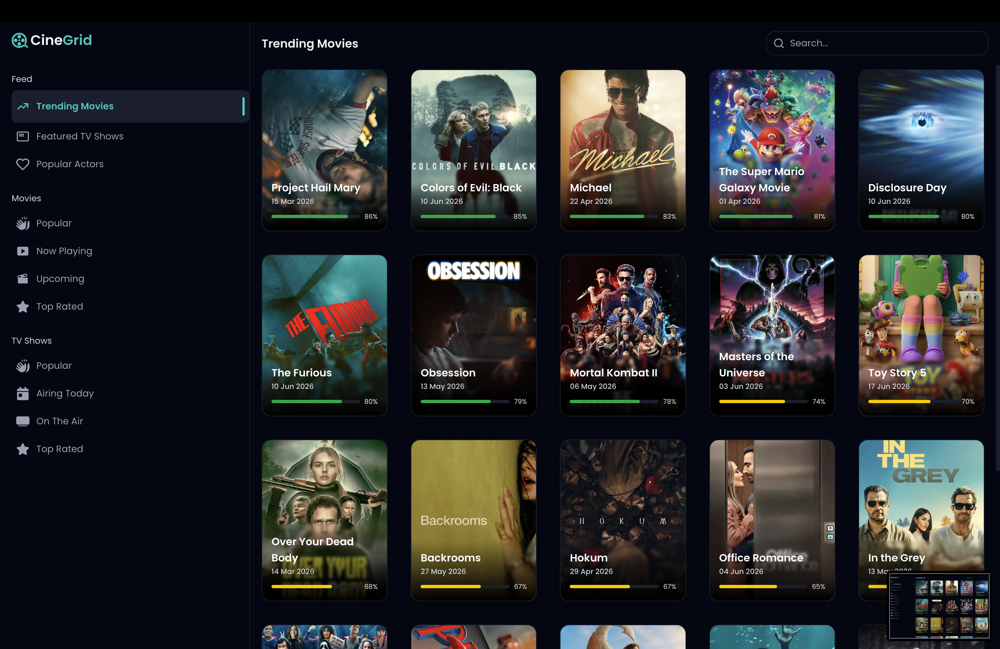
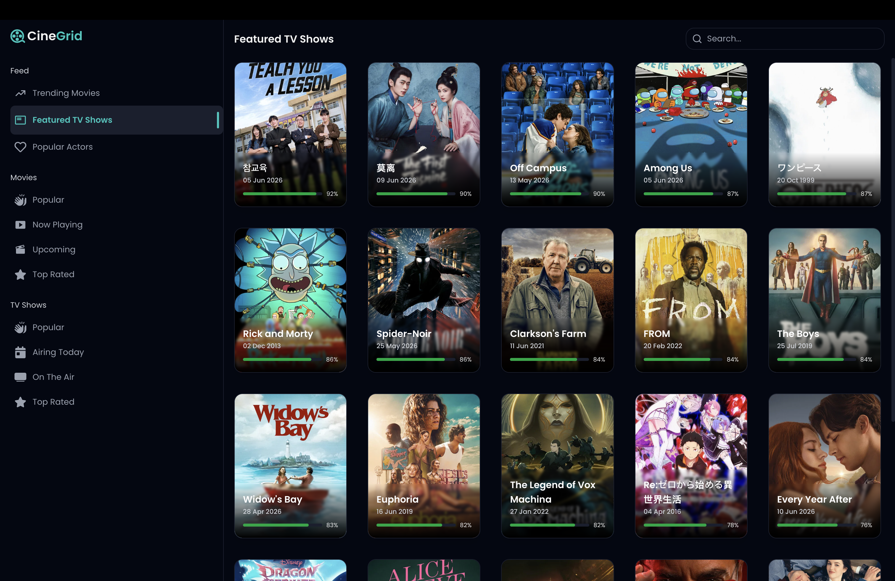
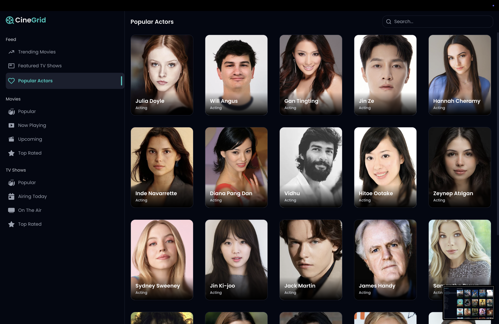

# Cinegrid
### A structured way to explore movies

<p align="center">

  

  
  
  

</p>


## Overview
 
**Cinegrid** is a modern, responsive web application built for movie enthusiasts. It provides a seamless experience to discover movies, browse trailers, read reviews, and check ratings — all in one beautifully designed interface. Powered by **React**, **TailwindCSS**, and **Vite**, Cinegrid delivers a fast, optimised experience on both desktop and mobile.

## Features

- Search for movies by title.
- View detailed information about each movie, including plot, actors, and ratings.
- Responsive design for mobile and desktop views.
- Built using **React**, **TailwindCSS**, and **Vite** for a fast and optimized user experience.

## Tech Stack

- **Frontend**: React, TailwindCSS
- **State Management**: React hooks (useState, useEffect)
- **Styling**: TailwindCSS for utility-first CSS styling
- **Build Tool**: Vite
- **Development Tools**: Vite, ESLint

## Installation

To get started with **Cinegrid** locally, follow these steps:

1. Clone the repository:

   ```bash
   git clone https://github.com/jibinkj-07/Cinegrid.git
   cd cinegrid
   ```

2. Install the dependencies:

   ```bash
   npm install
   ```

3. Run the app in development mode:

   ```bash
   npm run dev
   ```

   Your app will be running at [http://localhost:4173](http://localhost:4173).

## Scripts

- **`npm run dev`**: Starts the Vite development server.
- **`npm run build`**: Builds the app for production, optimizing and bundling the files.
- **`npm run preview`**: Previews the production build locally.
- **`npm run lint`**: Lints the code using ESLint.
- **`npm run start`**: Starts the app in production mode (for use in hosting).

## Live Demo

You can view the live version of the app at:

[[https://cinegrid-one-vercel.app](https://cinegrid-one.vercel.app/)]

## Deployment

This project is deployed using **Render**. To deploy the app to Render:

1. Push your code to a Git repository (e.g., GitHub).
2. Connect your Git repository to Render.
3. Set the **Build Command** to `npm run build`.
4. Set the **Start Command** to `npm run preview`.
5. Render will automatically build and deploy your app.

## Author

**Jibin K John**

Feel free to reach out via email or open an issue if you have any questions or suggestions.
